# SITE Program - Project Initiation
Welcome to CITE Program! This assignment is designed to help you get set up with your development environment and with our project participation system. It also gives us a chance to get to know you a little better, too!

This is not intended to take a very long time to complete, but please get started sooner rather than later so we can fix any issues before the first real project.

[Part 1: Getting started with GitHub](#part-1-getting-started-with-github)  
[Part 2: Get the PR00 code](#part-2-get-the-project00-code)  
[Part 3: Edit the PR00 code](#part-3-edit-the-project00-code)  
[Part 4: Upload to GitHub](#part-4-upload-to-gitHub)  
[Part 5: Publish your GitHub Page](#part-5-publish-your-gitHub-page)  
[Part 6: Submit](#part-6-submit)  

### Part 1: Getting started with GitHub
We will be using GitHub Classroom for project starter code distribution and submit contributions. This will lead you getting started with GitHub and Git.

If you are familiar with GitHub and have an account, skip to [Part 2](#part-2-get-the-project00-code).

**Q: What is Git and GitHub?**
* **Git** is a [version control system](https://www.atlassian.com/git/tutorials/what-is-version-control), which is a program that developers use to track and manage changes to source code over time.
* **GitHub** is a company that provides hosting for code that is managed by the Git version control system.
Git and GitHub are sophisticated tools for collaborative software development, used by millions of software developers worldwide. Git is incredibly powerful, but it has a somewhat notoriously steep learning curve.

Luckily for our projects, we will only be using a very small subset of Git and GitHub’s features.

#### 1. Sign up for a free Github account
Skip this if you already have a GitHub account.  
You will need a GitHub account to use GitHub Classroom.  
Sign up for one if you don’t have one already.  
#### 2. Get the GitHub Education Pack
Optional: This is useful in general, but not needed or beneficial for projet00.

* This is not necessary for CITE projects, but GitHub offers a bunch of free services for students, including free unlimited private GitHub repositories.
* Learn more and sign up via the Student Developer Pack.
### Part 2: Get the PR00 code
For CITE porjects, we will be using GitHub for the following purposes:

1. You will download the project starter code from GitHub.
2. You will upload your enhancement solution code to GitHub.
3. You will publish your web page(s) to the internet via GitHub Pages.
#### 1. Accept the PR00 assignment
* [Follow this link](https://classroom.github.com/a/kbF8Ashc), where PR00 is stored on GitHub Classroom.
* Click the green “Accept this assignment” button.  
&nbsp;
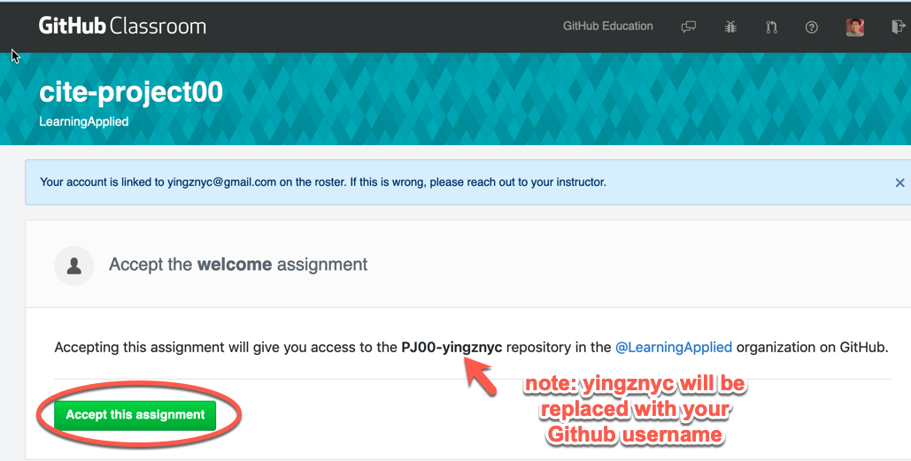  
&nbsp;
* Follow the link to your newly created assignment on the next screen. 
&nbsp;
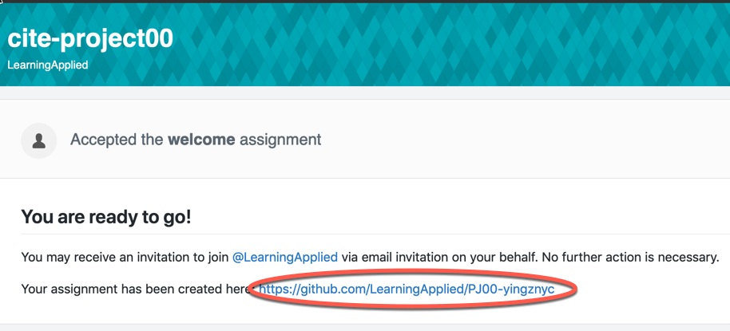 
&nbsp;
#### 2. Download the PR00 starter code
Technically, your newly created assignment is a “GitHub repository.”

* This is a private repository, meaning only you (and the course staff) can access it.
* This is basically a private online folder where you will ultimately store your finished homework files. Right now, though, it contains the starter code for the assignment.
At this point, you want to download the files in this repository.

**Git-speak for people who are very familiar with Git already:**  
_(Please **ignore this box entirely** if you’ve never used git before.)_
* The “assignment” created for you through the GitHub Classroom UI is a private GitHub repository like any other private GitHub repo you would own.
* You can clone, push, and pull to this repository using the command-line or whatever UI you prefer.
* If you want to use git to manage your assignment (as opposed to the GitHub web UI), just clone your assignment repository and skip to [Part 3](#part-3-edit-the-project00-code).

To download the starter code via the GitHub UI:
&nbsp;
* In your project repository (i.e. [this screen](repository.png)), click the green “Clone or download” button.  
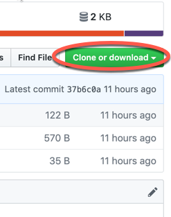
&nbsp;
* In the menu that pops up, click “Download ZIP” 
&nbsp;

&nbsp;
#### 3. View the starter code in a browser
Note that **Chrome** is the recommended browser for the project. Please either [install and use Chrome](https://www.google.com/chrome/) for development, or at least make sure to test your assignments in Chrome before submitting them.

* Unzip your downloaded zip file somewhere on your computer
* Open “index.html” in Chrome or another browser of your choosing.
* You should see something that looks like the following:
&nbsp;
&nbsp;
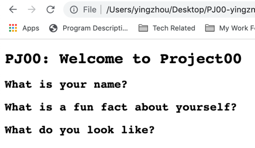
&nbsp;
### Part 3: Edit the Project00 code
#### 1. Download and install Atom
_Optional: We will be using Atom in lecture, but you may use whatever text editor you’d like._

We recommend that you use the [Atom text editor](https://atom.io/) for PR00.  

* [Download and install Atom](https://atom.io/)
It is not very important for you to use Atom if you prefer a different text editor, such as [Brackets](http://brackets.io/).

#### 2. Fix the TODOs in ```index.html```
* In Atom (or your preferred text editor), open ```index.html``` and fix the TODOs.
* Here is a screenshot of an example “solution”:  
&nbsp;  
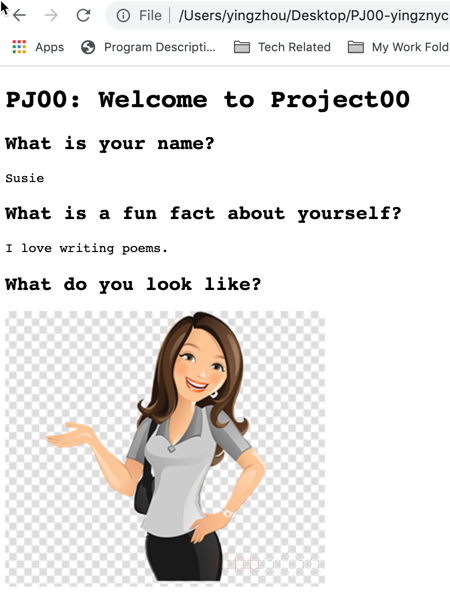
&nbsp;
* If you’d like, you can further style, decorate, or modify your page to your liking. 
### Part 4: Upload to GitHub
Now that you’ve completed the project, you should upload your files back to your Project00 repository.  
_Note: Both Part 4 and Part 5 should be executed in your own Project00 repository, not the copy from the classroom._

**Git-speak for people who are very familiar with Git already:**  
_(Please **ignore this box entirely** if you’ve never used git before.)_

* If you cloned your repository via git, just commit all changes and push them to the repository on GitHub.
* You can now skip to [Part 5](#part-5-publish-your-gitHub-page).  
* Navigate to your Project00 repository on GitHub (i.e. [this screen](repository.png)).
* Click the “Upload files” button.  
&nbsp;
  
&nbsp;
* On the next screen, select your ```index.html```, ```style.css```, and your image file for upload.  
Your screen should now look like the following:  
&nbsp;
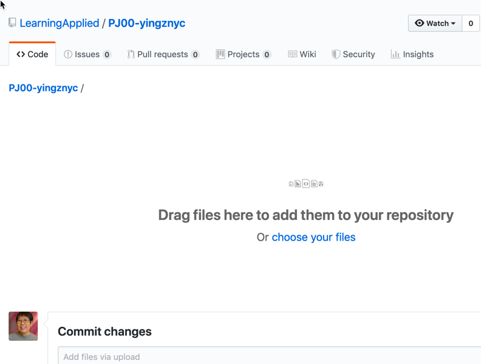  
&nbsp;
* (You actually don’t have to upload style.css again if you didn’t modify it.)
* Scroll to the bottom of the screen and click the green “Commit changes” button. You don’t need to fill out any of the form.  
&nbsp;
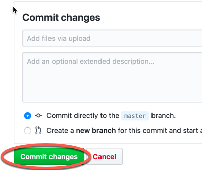
&nbsp;

* You should be redirected to the main repository screen again. The existing files should be updated and your new files should be uploaded.
### Part 5: Publish your GitHub Page
You will now publish your website as a GitHub page. This will make your website publicly accessible on the internet.

* Navigate to your Project00 repository on GitHub. (You should already be on this page.)
* Click the “Settings” button.  
&nbsp;  
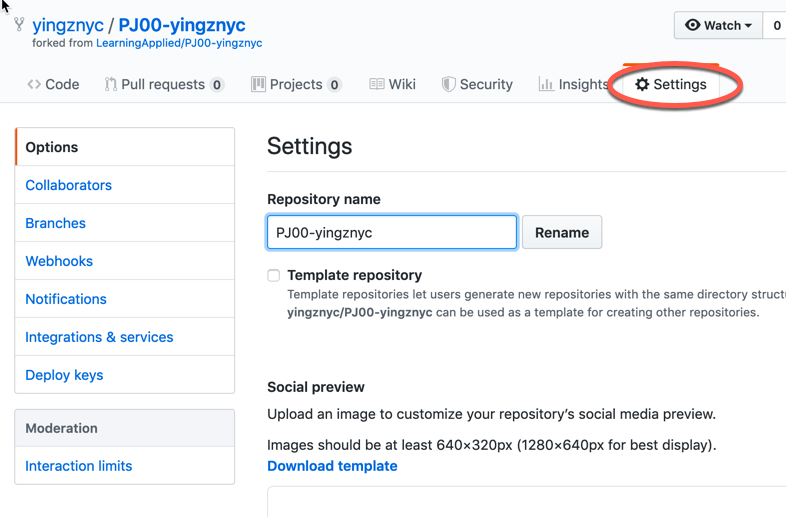  
&nbsp;  
* On the Settings page, scroll down near the bottom to the “GitHub Pages” section. Under “Source”, click the button that’s currently set to “None”…   
&nbsp;  
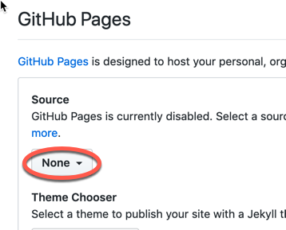  
&nbsp;  
… and change it to “master branch”:  
&nbsp;  
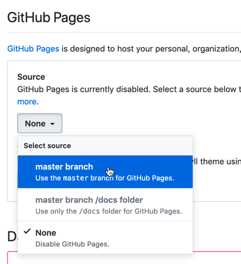  
&nbsp;  

* The page will reload and you will be taken back to the top of the Settings screen.  
* Scroll back down to the “GitHub Pages” section, and you should now see a link to your published GitHub page.  
&nbsp;  
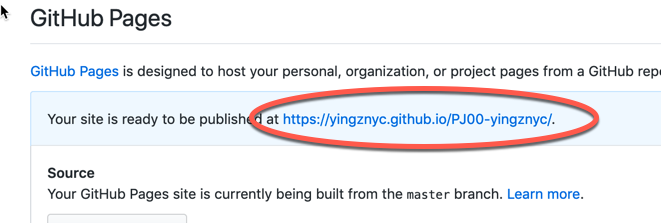  
&nbsp;  
* Click your link to verify it is working as expected.
* Note that this is a publicly accessible link. You can send it to your friends if you want to show it off!
Note: You may notice that on the Settings page, there is an option to make the repository public. Please do not do this.

### Part 6: Submit
Finally, turn in the link to your GitHub repository and a link to your completed web page via this form:

[Turn in Project00](https://forms.gle/6xMhztP2D5ZWVPxb7)
